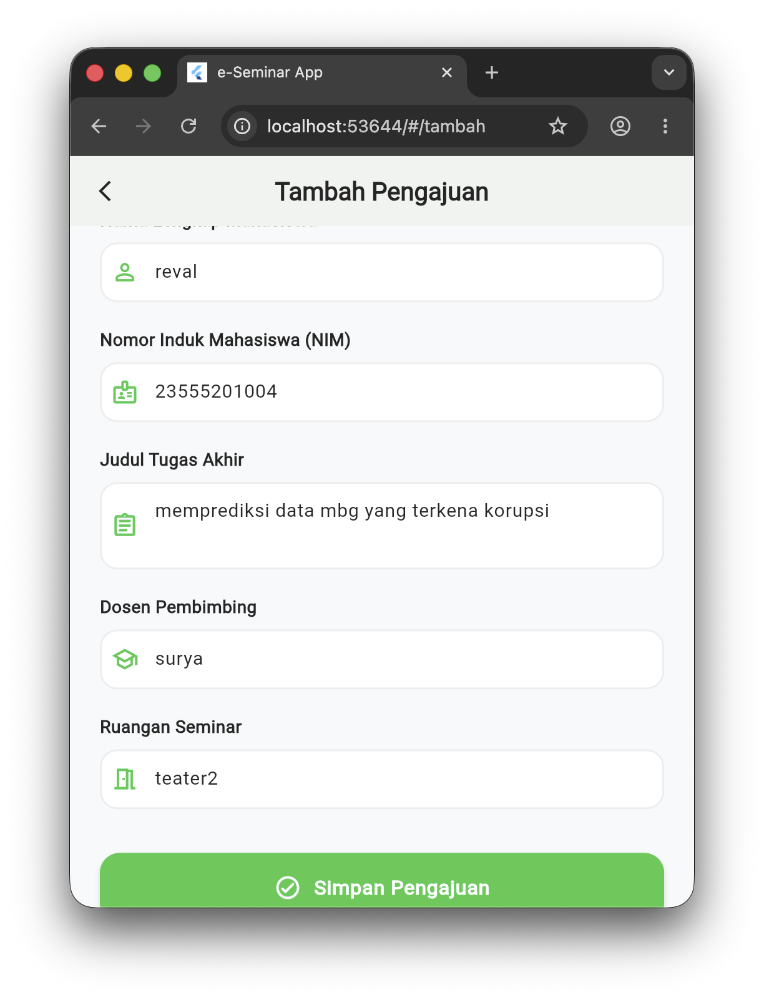
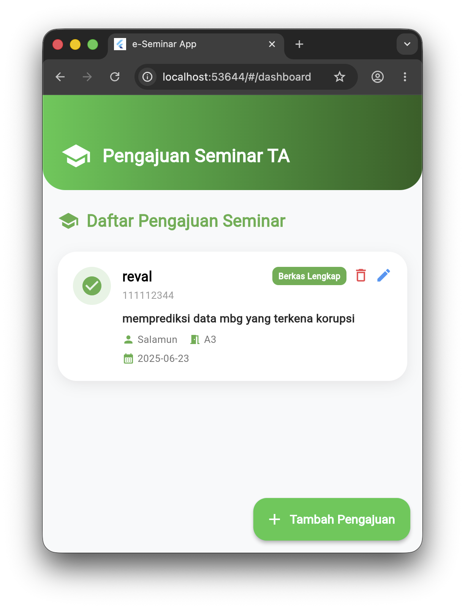
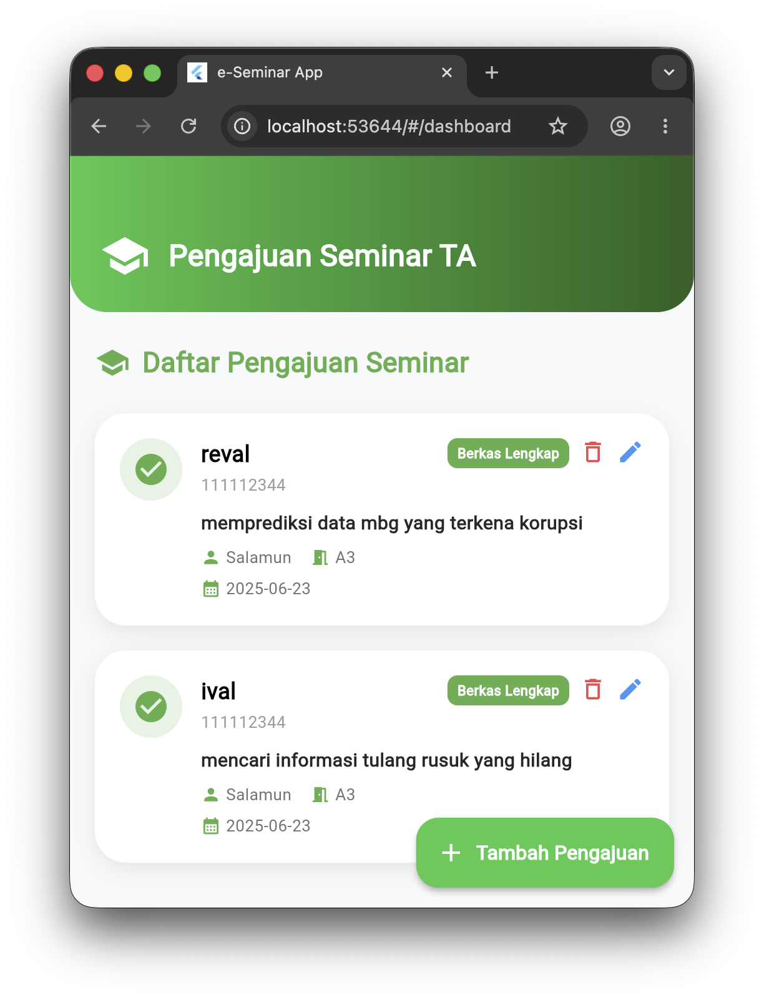

# e_seminarapp 🎓

Aplikasi manajemen pengajuan seminar Tugas Akhir (TA) mahasiswa berbasis Flutter yang dirancang dengan antarmuka (UI) modern, bersih, dan responsif beraksen hijau premium.

---

## 📸 Tampilan Aplikasi (Screenshots)

Berikut adalah dokumentasi tampilan aplikasi **e_seminarapp**. *(Pastikan file foto berada di dalam folder `screenshot/` dengan nama `1.png`, `2.png`, dan `3.png`)*.

| 🔐 Halaman Login | 📊 Dashboard Utama | 📝 Tambah Pengajuan |
| :---: | :---: | :---: |
|  |  |  |

---

## ✨ Fitur Utama Aplikasi

*   **Autentikasi Modern**: Sistem login bersih tanpa Appbar atas, dilengkapi fitur *toggle* mata untuk menyembunyikan/melihat password serta validasi error.
*   **Custom Dashboard Bergradasi**: Header atas menggunakan gradasi hijau linear yang elegan, serta list data mahasiswa menggunakan *Custom Card* ber-shadow halus.
*   **Formulir Pengajuan Lengkap**: Input data yang sudah dilengkapi dengan icon penanda visual di setiap kolomnya (Nama, NIM, Judul TA, Dosen, dan Ruangan).
*   **State Management Reaktif**: Menggunakan `Provider` untuk memproses penambahan dan penghapusan data secara *real-time*.

---

## 🚀 Cara Menjalankan Projek

Jika Anda ingin menjalankan projek ini di lokal komputer Anda, ikuti langkah berikut:

1. **Clone Repositori ini:**
```bash
   git clone [https://github.com/revaldiermann/e_seminar.app.git](https://github.com/revaldiermann/e_seminar.app.git)
